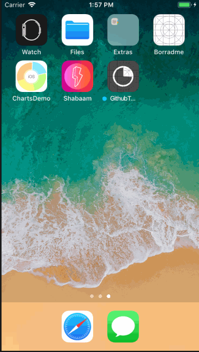

# Github Trends

List trending projects of Github and when tap on one of them, show their details.

Requirements for project:

- MVVM
- Swift 3.2 or later
- ReactiveCocoa 6.0+ (Nice to have)

I used my MVVM implementation, I didn't have time to include ReactiveCocoa. 

I'm not using pods nor carthage.

To run project just open `Github Trends.xcodeproj` and run.

## Tests

Added tests for models and view models mocking my HttpClient.

## Sample

